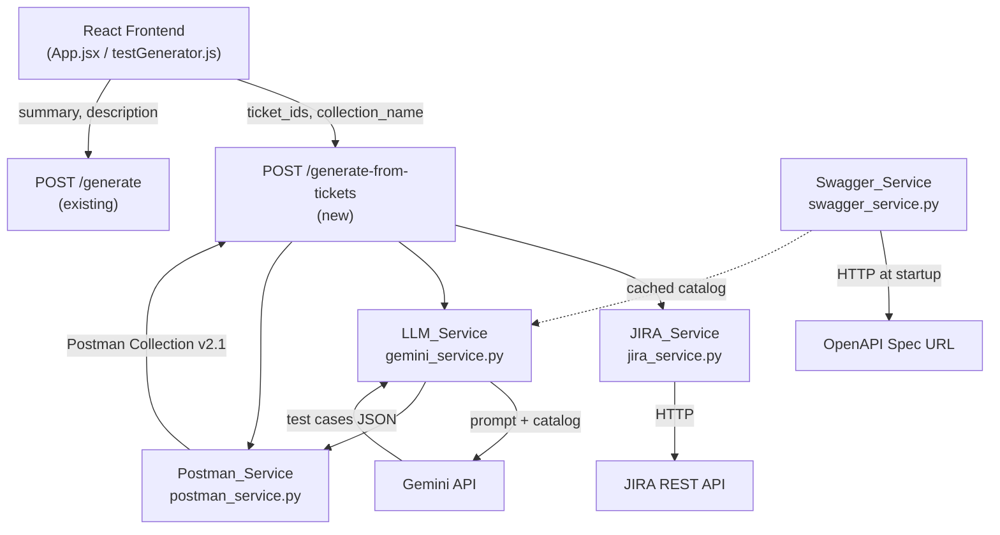

# Design Document: Enhanced API Test Coverage

## Overview

This feature extends CollectionAI in two directions: richer test generation (positive, negative, and edge cases with real Postman test scripts) and multi-ticket input that produces a single end-to-end Postman collection. It also introduces Swagger-grounded generation so the LLM can reference real API endpoints even when JIRA tickets are vague.

The changes touch every layer of the stack:
- A new `swagger_service.py` fetches and caches the OpenAPI spec at startup.
- `jira_service.py` is implemented to fetch parent tickets and their subtasks.
- `gemini_service.py` is updated with a catalog-aware, coverage-mode prompt.
- `postman_service.py` gains multi-suite assembly and `[Inferred]` flagging.
- `main.py` gains the `POST /generate-from-tickets` endpoint.
- `models.py` gains request/response Pydantic models for the new endpoint.
- `config.py` is extended with JIRA and Swagger env vars.
- The React frontend gains a multi-ticket input mode, loading state, warnings display, and a named download.

---

## Architecture



**Startup sequence**: when FastAPI starts, `swagger_service.py` fetches the OpenAPI spec from `SWAGGER_URL` and stores the parsed catalog in a module-level variable. If the fetch fails, it logs a warning and sets the catalog to `None`; the rest of the app starts normally.

**Request flow for `POST /generate-from-tickets`**:
1. Validate request (1–20 ticket IDs).
2. For each ticket ID, call `JIRA_Service.fetch_ticket_with_subtasks()`. Collect warnings for any that fail.
3. If all tickets failed, return HTTP 400.
4. For each successfully fetched ticket, call `LLM_Service.generate_test_cases_comprehensive()` with the ticket context and the cached API catalog.
5. For each result, call `Postman_Service.build_test_suite()` to produce a named folder.
6. Call `Postman_Service.assemble_collection()` to merge all suites into one collection.
7. Return HTTP 200 with `postman_collection` and `warnings`.

---

## Components and Interfaces

### swagger_service.py (new)

```python
def load_catalog(swagger_url: str) -> dict | None:
    """Fetch and parse the OpenAPI spec. Returns a simplified catalog dict or None."""

def get_catalog() -> dict | None:
    """Return the cached catalog (module-level singleton)."""
```

The catalog is a simplified dict extracted from the OpenAPI spec:
```python
{
  "endpoints": [
    {
      "path": "/users/{id}",
      "method": "GET",
      "summary": "Get user by ID",
      "parameters": [...],   # OpenAPI parameter objects
      "request_body": {...}, # OpenAPI requestBody schema (if present)
      "responses": {...}     # OpenAPI responses object
    },
    ...
  ]
}
```

Only `paths` is extracted; `components/schemas` are inlined via `$ref` resolution so the LLM receives self-contained schema snippets.

### jira_service.py (new implementation)

```python
def fetch_ticket(ticket_id: str) -> dict:
    """Fetch summary + description for a single JIRA issue. Raises on auth error."""

def fetch_subtasks(ticket_id: str) -> list[dict]:
    """Fetch child issues (subtasks) of a parent story. Returns [] if none."""

def fetch_ticket_with_subtasks(ticket_id: str) -> dict:
    """Return merged context: parent ticket + subtask list."""
```

Return shape of `fetch_ticket_with_subtasks`:
```python
{
  "id": "PROJ-123",
  "summary": "...",
  "description": "...",
  "subtasks": [
    {"id": "PROJ-124", "summary": "...", "description": "..."},
    ...
  ]
}
```

Authentication uses HTTP Basic Auth with `JIRA_EMAIL` and `JIRA_API_TOKEN`. The base URL is `JIRA_BASE_URL`. Missing env vars raise a `ConfigurationError` that the endpoint handler converts to HTTP 503.

### gemini_service.py (updated)

New function alongside the existing `generate_test_cases`:

```python
def generate_test_cases_comprehensive(ticket_context: dict, catalog: dict | None) -> dict:
    """
    Generate positive, negative, and edge case test cases.
    Returns {"test_cases": [...], "warnings": [...]}
    """
```

The existing `generate_test_cases` is left untouched to preserve the `/generate` endpoint.

### postman_service.py (updated)

```python
def build_test_suite(ticket_context: dict, flow_steps: list) -> dict:
    """
    Build a single Postman folder for one ticket from an ordered flow_steps list.
    - Items are ordered by ascending `step` number.
    - For each step with non-empty `variable_extractions`, appends pm.environment.set(...)
      calls to the item's test event script.
    - For each step with non-empty `variable_usages`, ensures {{variableName}} references
      are present in the request URL, headers, or body (passed through from LLM output).
    - Prefixes inferred step names with [Inferred] and adds a description note.
    """

def assemble_collection(suites: list[dict], collection_name: str, ticket_ids: list[str]) -> dict:
    """Merge multiple test suite folders into one Postman Collection v2.1 document."""
```

The existing `create_postman_collection` is preserved for the `/generate` endpoint.

### main.py (updated)

New endpoint added; existing `/generate` endpoint is unchanged:

```python
@app.post("/generate-from-tickets")
async def generate_from_tickets(request: MultiTicketRequest) -> MultiTicketResponse:
    ...
```

Startup event registers the Swagger catalog load:

```python
@app.on_event("startup")
async def startup_event():
    swagger_service.load_catalog(config.SWAGGER_URL)
```

### config.py (updated)

```python
GOOGLE_API_KEY = os.getenv("GOOGLE_API_KEY")
JIRA_BASE_URL  = os.getenv("JIRA_BASE_URL")
JIRA_EMAIL     = os.getenv("JIRA_EMAIL")
JIRA_API_TOKEN = os.getenv("JIRA_API_TOKEN")
SWAGGER_URL    = os.getenv("SWAGGER_URL")
```

---

## Data Models

### Request model

```python
class MultiTicketRequest(BaseModel):
    ticket_ids: list[str] = Field(..., min_items=1, max_items=20)
    collection_name: str | None = None
```

Validation: FastAPI/Pydantic returns HTTP 422 automatically when `ticket_ids` is empty or missing.

### Response model

```python
class MultiTicketResponse(BaseModel):
    postman_collection: dict
    warnings: list[str] = []
```

### Internal test case shape (LLM output)

The LLM returns a `flow_steps` list rather than a flat `test_cases` list. Each step carries its position, role, variable wiring metadata, and test script:

```python
{
  "flow_steps": [
    {
      "step": 1,
      "id": "TC-01",
      "title": "Get auth token",
      "role": "prerequisite",   # "prerequisite" | "primary" | "teardown"
      "type": "positive",       # "positive" | "negative" | "edge"
      "method": "POST",
      "endpoint": "/auth/token",
      "request_body": {...},
      "expected_status": 200,
      "inferred": False,
      "variable_extractions": [
        {"variable": "authToken", "json_path": "$.token"}
      ],
      "variable_usages": [],
      "test_script": "..."
    },
    {
      "step": 2,
      "id": "TC-02",
      "title": "Get advertiser by ID",
      "role": "prerequisite",
      "type": "positive",
      "method": "GET",
      "endpoint": "/advertisers/{{advertiserId}}",
      "request_body": None,
      "expected_status": 200,
      "inferred": False,
      "variable_extractions": [
        {"variable": "advertiserId", "json_path": "$.id"}
      ],
      "variable_usages": ["authToken"],
      "test_script": "..."
    },
    {
      "step": 3,
      "id": "TC-03",
      "title": "Create campaign - valid payload",
      "role": "primary",
      "type": "positive",
      "method": "POST",
      "endpoint": "/campaigns",
      "request_body": {...},
      "expected_status": 201,
      "inferred": False,
      "variable_extractions": [],
      "variable_usages": ["authToken", "advertiserId"],
      "test_script": "..."
    }
  ],
  "warnings": []
}
```

When `inferred` is `true`, `postman_service.build_test_suite` prefixes the request name with `[Inferred]` and adds a description note.

---

## LLM Prompt Design

The prompt sent to Gemini for comprehensive generation is structured in three sections:

**Section 1 — Role and rules**
```
You are an expert QA engineer generating a Postman test suite.
Rules:
- Always use {{baseUrl}} as the host variable.
- Generate at least 1 positive, 2 negative, and 1 edge case test per API endpoint.
- For non-GET requests include a realistic request body derived from the ticket.
- For each test case include a Postman test script asserting the expected HTTP status code.
- If an endpoint is not in the API Catalog, include it but set "inferred": true.
- If you cannot determine required API details, add a warning string to the "warnings" array.
- Analyze the API Catalog to identify all prerequisite calls needed before the primary API (auth tokens, entity lookups, etc.).
- Order all steps so dependencies come before the calls that need them.
- For each step that produces a value needed by a later step, add a variable_extraction entry with the variable name and JSON path.
- Reference extracted variables in subsequent steps using {{variableName}} syntax in URL, headers, and body.
- Group steps by role: "prerequisite" first, then "primary", then "teardown".
```

**Section 2 — API Catalog (grounding context)**
```
API Catalog (from OpenAPI spec):
<serialized JSON of catalog["endpoints"], truncated to ~8000 tokens if large>
```
If the catalog is `None` (Swagger fetch failed), this section is omitted and a note is added: `"No API catalog available — infer endpoints from ticket context."`

**Section 3 — Ticket context**
```
Parent Ticket: PROJ-123
Summary: <summary>
Description: <description>

Subtasks:
- PROJ-124: <summary> — <description>
- PROJ-125: <summary> — <description>
```

**Output format instruction**
```
Return ONLY valid JSON with this structure:
{
  "flow_steps": [
    {
      "step": <int>,
      "id": <str>,
      "title": <str>,
      "role": "prerequisite" | "primary" | "teardown",
      "type": "positive" | "negative" | "edge",
      "method": <str>,
      "endpoint": <str>,
      "request_body": <dict> | null,
      "expected_status": <int>,
      "inferred": <bool>,
      "variable_extractions": [{"variable": <str>, "json_path": <str>}],
      "variable_usages": [<str>],
      "test_script": <str>
    }
  ],
  "warnings": []
}
```

Subtask API details (explicit endpoint/method/payload) are placed before the parent description in the prompt so the LLM treats them as higher-priority context (Requirement 6.8).

---

## Postman Collection Assembly

`build_test_suite` converts one ticket's flow steps into a Postman folder. Steps are sorted by their `step` number before insertion. For each step with `variable_extractions`, the generated test event script appends `pm.environment.set(variableName, <jsonpath expression>)` calls after the status assertion. `{{variableName}}` references in URL, headers, and body are passed through from the LLM output as-is (the LLM is instructed to emit them directly).

```json
{
  "name": "PROJ-123 — Create user endpoint",
  "item": [
    {
      "name": "Create user - valid payload",
      "request": {
        "method": "POST",
        "header": [{"key": "Content-Type", "value": "application/json"}],
        "url": {"raw": "{{baseUrl}}/users", "host": ["{{baseUrl}}"], "path": ["users"]},
        "body": {"mode": "raw", "raw": "{...}"}
      },
      "event": [{"listen": "test", "script": {"exec": ["...pm.test..."]}}]
    }
  ]
}
```

`[Inferred]` items get an additional `description` field: `"Endpoint not found in API Catalog — verify before running."`

`assemble_collection` wraps all suite folders into a single Collection v2.1 document:

```json
{
  "info": {
    "name": "<collection_name or first ticket ID>",
    "description": "Generated from tickets: PROJ-123, PROJ-124",
    "schema": "https://schema.getpostman.com/json/collection/v2.1.0/collection.json"
  },
  "item": [ <suite folders in submission order> ]
}
```

---

## Frontend Changes

The React frontend gains a second input mode while keeping the existing manual description form.

**New state**:
- `mode`: `"tickets"` | `"manual"` (toggle between modes)
- `ticketInput`: raw string from the multi-ticket textarea
- `collectionName`: optional name input
- `warnings`: array of warning strings from the response

**Multi-ticket flow**:
1. User selects "Ticket IDs" mode.
2. Pastes comma- or newline-separated IDs into a textarea.
3. Optionally enters a collection name.
4. Clicks "Generate Collection" → `POST /generate-from-tickets`.
5. While loading, a spinner/disabled button is shown.
6. On success: warnings (if any) are shown in a yellow banner; download and copy buttons appear.
7. Download filename: `<collectionName || firstTicketId>_collection.json`.

**Existing manual mode** (`POST /generate`) is preserved as-is under the "Manual" tab.

---

## Error Handling

| Scenario | Behavior |
|---|---|
| `JIRA_BASE_URL` / `JIRA_EMAIL` / `JIRA_API_TOKEN` missing | HTTP 503 with message naming the missing variable |
| JIRA returns 401/403 | HTTP 502 with "JIRA authentication failed" |
| Single ticket ID not found (404) | Skip ticket, add warning, continue |
| All ticket IDs fail | HTTP 400 listing all failed IDs |
| `ticket_ids` empty or missing | HTTP 422 (Pydantic validation) |
| Gemini API error for one ticket | Skip ticket, add warning with ticket ID |
| Gemini returns unparseable JSON | Retry once; if still fails, skip ticket with warning |
| `SWAGGER_URL` missing or fetch fails | Log warning, continue with `catalog = None` |
| LLM cannot identify any APIs | Return best-effort collection + warning per Req 1.7 / 6.9 |

---

## Correctness Properties

*A property is a characteristic or behavior that should hold true across all valid executions of a system — essentially, a formal statement about what the system should do. Properties serve as the bridge between human-readable specifications and machine-verifiable correctness guarantees.*


### Property 1: Comprehensive coverage per ticket

*For any* ticket submitted to the generator, the returned test cases list shall contain at least one item with `type = "positive"`, at least two items with `type = "negative"`, and at least one item with `type = "edge"`.

**Validates: Requirements 1.1, 1.2, 1.3**

---

### Property 2: Test case structural completeness

*For any* generated test case, the item shall have a non-empty `method`, a non-empty `endpoint`, a non-null `expected_status`, and a non-empty `test_script` field.

**Validates: Requirements 1.4, 1.5**

---

### Property 3: Non-GET requests include a request body

*For any* generated test case whose `method` is not `"GET"`, the corresponding Postman item's `request.body.raw` field shall be non-null and non-empty.

**Validates: Requirements 1.6**

---

### Property 4: All request URLs use {{baseUrl}}

*For any* generated Postman collection, every request item's `url.raw` field shall start with `"{{baseUrl}}"`.

**Validates: Requirements 1.8**

---

### Property 5: Ticket fetch returns summary and description

*For any* valid JIRA ticket ID, `fetch_ticket_with_subtasks` shall return a dict containing non-empty `summary` and `description` fields.

**Validates: Requirements 2.1, 3.4**

---

### Property 6: Skipped ticket ID appears in warnings

*For any* batch request containing a ticket ID that does not exist in JIRA, the response `warnings` array shall contain at least one string that references that ticket ID.

**Validates: Requirements 2.3**

---

### Property 7: Collection structure matches submission order

*For any* batch of N successfully processed ticket IDs submitted in a given order, the resulting collection's top-level `item` array shall contain exactly N folders appearing in the same order as the submitted IDs.

**Validates: Requirements 2.4, 2.5**

---

### Property 8: Collection description lists processed ticket IDs

*For any* batch of successfully processed ticket IDs, the assembled collection's `info.description` field shall contain each of those ticket IDs as a substring.

**Validates: Requirements 2.6**

---

### Property 9: Missing JIRA credential returns 503

*For any* subset of the required JIRA environment variables (`JIRA_BASE_URL`, `JIRA_EMAIL`, `JIRA_API_TOKEN`) that is absent, a call to `POST /generate-from-tickets` shall return HTTP 503 with a message identifying the missing variable.

**Validates: Requirements 3.2**

---

### Property 10: Ticket ID input parsing

*For any* string of ticket IDs separated by commas, newlines, or a mix of both, the frontend parser shall produce an array of trimmed, non-empty strings matching the original IDs with no duplicates introduced and no IDs dropped.

**Validates: Requirements 4.1**

---

### Property 11: Download filename derivation

*For any* pair of `(collectionName, ticketIds)` where `collectionName` is provided, the download filename shall equal `<collectionName>_collection.json`; when `collectionName` is absent, it shall equal `<ticketIds[0]>_collection.json`.

**Validates: Requirements 4.3**

---

### Property 12: Warnings rendered in UI

*For any* response containing a non-empty `warnings` array, the rendered UI shall display each warning string visibly to the user.

**Validates: Requirements 4.5**

---

### Property 13: Successful response structure

*For any* request to `POST /generate-from-tickets` where at least one ticket is processed successfully, the response shall be HTTP 200 and the body shall contain both a `postman_collection` object and a `warnings` array (which may be empty).

**Validates: Requirements 5.2**

---

### Property 14: API catalog included in prompt when available

*For any* call to `generate_test_cases_comprehensive` where the cached catalog is non-None, the prompt string passed to the Gemini API shall contain at least one endpoint path from the catalog.

**Validates: Requirements 6.3**

---

### Property 15: Inferred test cases are prefixed

*For any* test case returned by the LLM with `inferred = true`, the corresponding Postman item's `name` field shall start with `"[Inferred]"` and the item's `request.description` shall contain a note indicating the endpoint was not found in the API catalog.

**Validates: Requirements 6.5, 6.6**

---

### Property 16: Subtasks included in ticket context

*For any* parent JIRA ticket that has one or more subtask child issues, `fetch_ticket_with_subtasks` shall return a dict whose `subtasks` list contains at least one entry with non-empty `summary` and `description` fields.

**Validates: Requirements 6.7**

---

### Property 17: Subtask API details precede parent description in prompt

*For any* ticket context where at least one subtask contains an explicit endpoint path or HTTP method, the prompt string passed to the Gemini API shall place that subtask's API details before the parent ticket's description text.

**Validates: Requirements 6.8**

---

### Property 18: E2E flow step ordering

*For any* generated collection where the LLM returns `flow_steps` with step numbers, the Postman folder's `item` array shall contain requests in ascending step order.

**Validates: Requirements 7.2**

---

### Property 19: Variable extraction scripts generated

*For any* flow step with a non-empty `variable_extractions` list, the corresponding Postman item's test event script shall contain a `pm.environment.set(variableName, ...)` call for each extraction entry.

**Validates: Requirements 7.3**

---

### Property 20: Variable references use Postman syntax

*For any* flow step whose `variable_usages` list is non-empty, the corresponding Postman item's request URL, headers, or body shall contain `{{variableName}}` for each referenced variable.

**Validates: Requirements 7.4**

---

### Property 21: Prerequisite steps precede primary steps

*For any* generated flow, all steps with `role = "prerequisite"` shall appear before all steps with `role = "primary"` in the Postman folder's `item` array.

**Validates: Requirements 7.2, 7.5**

---

## Error Handling

See the Error Handling table in the Architecture section above. Key decisions:

- JIRA credential errors are detected at request time (not startup) to allow the app to start without JIRA config when only the `/generate` endpoint is used.
- Swagger fetch failure is non-fatal; the LLM falls back to pure ticket-context inference.
- Per-ticket LLM failures are isolated — one bad ticket does not abort the whole batch.
- Gemini JSON parse failures trigger one retry before the ticket is skipped with a warning.

---

## Testing Strategy

### Dual approach

Both unit tests and property-based tests are required. Unit tests cover specific examples, integration points, and error conditions. Property tests verify universal invariants across randomized inputs.

### Unit tests

Focus areas:
- `swagger_service.load_catalog` with a mock HTTP response — verifies schema parsing and `$ref` inlining.
- `jira_service.fetch_ticket_with_subtasks` with mocked JIRA responses — verifies field extraction and subtask merging.
- `postman_service.build_test_suite` with a fixed test case list — verifies `[Inferred]` prefixing and `{{baseUrl}}` usage.
- `postman_service.assemble_collection` with two suites — verifies folder order and description content.
- `POST /generate-from-tickets` endpoint — HTTP 422 on empty `ticket_ids`, HTTP 400 when all tickets fail, HTTP 503 on missing JIRA env vars.
- Frontend `parseTicketIds` utility — comma/newline/mixed input examples.

### Property-based tests

Library: **Hypothesis** (Python) for backend; **fast-check** (npm) for frontend.

Each property test runs a minimum of **100 iterations**.

Each test is tagged with a comment in the format:
`# Feature: enhanced-api-test-coverage, Property <N>: <property_text>`

| Property | Test description |
|---|---|
| P1 | Generate random ticket dicts → assert ≥1 positive, ≥2 negative, ≥1 edge in result |
| P2 | Generate random ticket dicts → assert every test case has method, endpoint, expected_status, test_script |
| P3 | Filter non-GET test cases → assert request body is non-null/non-empty |
| P4 | Generate random collections → assert every url.raw starts with `{{baseUrl}}` |
| P5 | Generate random valid ticket IDs (mocked JIRA) → assert summary and description present |
| P6 | Generate batches with random invalid IDs → assert each invalid ID appears in warnings |
| P7 | Generate random N-ticket batches → assert collection has N folders in submission order |
| P8 | Generate random ticket ID lists → assert each ID appears in collection description |
| P9 | Generate random subsets of missing env vars → assert HTTP 503 with correct message |
| P10 | Generate random separator-mixed ID strings → assert parsed array matches expected IDs |
| P11 | Generate random (collectionName, ticketIds) pairs → assert filename derivation rule |
| P12 | Generate random warnings arrays → assert each warning string appears in rendered UI |
| P13 | Generate random valid requests → assert HTTP 200 with postman_collection and warnings |
| P14 | Generate random non-None catalogs → assert prompt contains at least one catalog endpoint |
| P15 | Generate random inferred test cases → assert [Inferred] prefix and description note |
| P16 | Generate random tickets with subtasks → assert subtasks list is non-empty with required fields |
| P17 | Generate random subtask contexts with explicit API details → assert ordering in prompt |
| P18 | Generate random flow_steps with arbitrary step numbers → assert Postman folder items are in ascending step order |
| P19 | Generate random flow_steps with non-empty variable_extractions → assert each extraction produces a pm.environment.set call in the test script |
| P20 | Generate random flow_steps with non-empty variable_usages → assert each usage appears as {{variableName}} in the request URL, headers, or body |
| P21 | Generate random flows mixing prerequisite and primary steps → assert all prerequisite items appear before all primary items in the folder |
